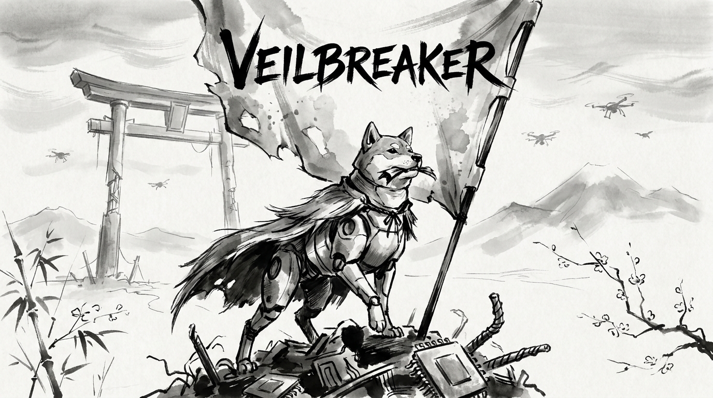

# veilbreaker

<p align="center">
  
</p>

<p align="center">
<b>⛓️‍💥🤖 Veilbreaker repo</b>
</p>

<p align="center">
<p align="center">
  <a href="#key-features">Key Features</a> •
  <a href="#quick-start">Quick Start</a> •
  <a href="#configuration">Configuration</a> •
  <a href="#credits">Credits</a> •
  <a href="#about-the-core-contributors">About the Core Contributors</a>
</p>

</p>

<p align="center">
  
  
  
  

</p>

--- 


## Key Features

Opinionated Python stack for fast development. The `saas` branch extends `main` with web framework, auth, and payments.

| Feature | `main` | `saas` |
|---------|:------:|:------:|
| UV + Pydantic config | ✅ | ✅ |
| CI/Linters (Ruff, Vulture) | ✅ | ✅ |
| Pre-commit hooks (prek) | ✅ | ✅ |
| LLM (DSPY + LangFuse Observability) | ✅ | ✅ |
| FastAPI + Uvicorn | ❌ | ✅ |
| SQLAlchemy + Alembic | ❌ | ✅ |
| Auth (WorkOS + API keys) | ❌ | ✅ |
| Payments (Stripe) | ❌ | ✅ |
| Referrals + Agent system | ❌ | ✅ |
| Ralph Wiggum Agent Loop | ✅ | ✅ |

[Full comparison](manual_docs/branch_comparison.md)

## Quick Start

- `make onboard` - interactive onboarding CLI (rename, deps, env, hooks, media)
- `make all` - sync deps and run `main.py`
- `make fmt` - runs `ruff format` + JSON formatting
- `make test` - runs all tests in `tests/`
- `make ci` - runs all CI checks (ruff, vulture, ty, etc.)


## Configuration

```python
from common import global_config

# Access config values from common/global_config.yaml
global_config.example_parent.example_child

# Access secrets from .env
global_config.OPENAI_API_KEY
```

[Full configuration docs](manual_docs/configuration.md)

## Credits

This software uses the following tools:
- [Cursor: The AI Code Editor](https://cursor.com)
- [uv](https://docs.astral.sh/uv/)
- [prek: Rust-based pre-commit framework](https://github.com/j178/prek)
- [DSPY: Pytorch for LLM Inference](https://dspy.ai/)
- [LangFuse: LLM Observability Tool](https://langfuse.com/)

## About the Core Contributors

<a href="https://github.com/Miyamura80/Python-Template/graphs/contributors">
  
</a>

Made with [contrib.rocks](https://contrib.rocks).
